## user-service API
#### GET /v1/users
Pridobi seznam uporabnikov
#### POST /v1/users
Shrani novega uporabnika
#### GET /v1/users/id
Pridobi podrobnejše podatke o uporabniku z id
#### PUT /v1/users/id
Popravi podatke o obstoječem uporabniku z id
#### DELETE /v1/users/id
Izbriše uporabnike z id

## photo-service API
#### GET /v1/photos
Pridobi seznam vseh fotografij
#### POST /v1/photos
Shrani novo fotografijo
#### GET /v1/photos/id
Pridobi podrobnješe podatke o fotografiji z id
#### PUT /v1/photos/id
Popravi podatke o obstoječi fotografiji z id
#### DELETE /v1/photos/id
Izbriše fotografijo z id

## album-service API
#### GET /v1/albums
Pridobi seznam albumov
#### POST /v1/albums
Shrani nov album
#### GET /v1/albums/id
Pridobi podrobnejše informacije o albumu z id
#### POST /v1/albums/id
Shrani sliko v album z id
#### PUT /v1/albums/id
Popravi podatke o obstoječem albumu z id
#### DELETE /v1/albums/id
Izbriše album z id
#### GET /v1/albums/user/id
Pridobi seznam albumov za userja
#### DELETE /v1/albumId/photo/photoId
Iz albuma z albumId izbriše fotografijo z photoId

## comment-service API
#### GET /v1/comments
Pridobi seznam komentarjev
#### POST /v1/comments
Shrani nov komentar
#### GET /v1/comments/id
Pridobi podrobnejše informacije o komentarju z id
#### PUT /v1/comments/id
Popravi podatek o obstoječem komentarju z id
#### DELETE /v1/comments/id
Izbriše komentar z id
#### GET /v1/comments/user/id
Pridobi seznam komentarjev za uporabnika z id
#### GET /v1/comments/photo/id
Pridobi seznam komentarjev za sliko z id

## share-service API
#### GET /v1/shares
Pridobi seznam vseh delitev slik
#### POST /v1/shares
Shrani novo delitev slike
#### GET /v1/shares/id
Pridobi podrobnejše informacije o delitvi
#### PUT /v1/shares/id
Popravi podatke delitve z id
#### DELETE /v1/shares/id
Izbriše delitev z id
#### GET /v1/shares/user/id
Pridobi seznam slik, ki ji uporabnik z id lahko vidi (so bile deljene z njim)

#### Uporaba zunanjega API-ja za generiranje slik robotov:
https://rapidapi.com/blaazetech/api/robohash-image-generator<br>
Uporablja se v robot-service kjer s klicem /v1/robots/neka_beseda zgeneriramo sliko robota z neka_beseda

Vsi POST in PUT klici sprejmejo kot argument JSON objekt, vsi klici pa vračajo odgovore
v obliki JSON objekt.<br>
Klici znotraj storitev so prikazani na spodnji sliki.
```mermaid
graph LR;
A[UserService];
B[PhotoSerivce];
C[AlbumSerivce];
D[CommentService];
E[ShareService];
F[RobotService];
A-->|pridobi slike uporabnika|B;
A-->|pridobi albume uporabnika|C;
B-->|pridobi komentarje slike|D;
C-->|pridobi slike, ki so v albumu|B;
D-->|pridobi ime in priimek uporabnika, ki je komentiral|A
E-->|pridobi slike|B;

Github zaenkat še ne podpira mermaid markupa tako da je spodej slika.

```
